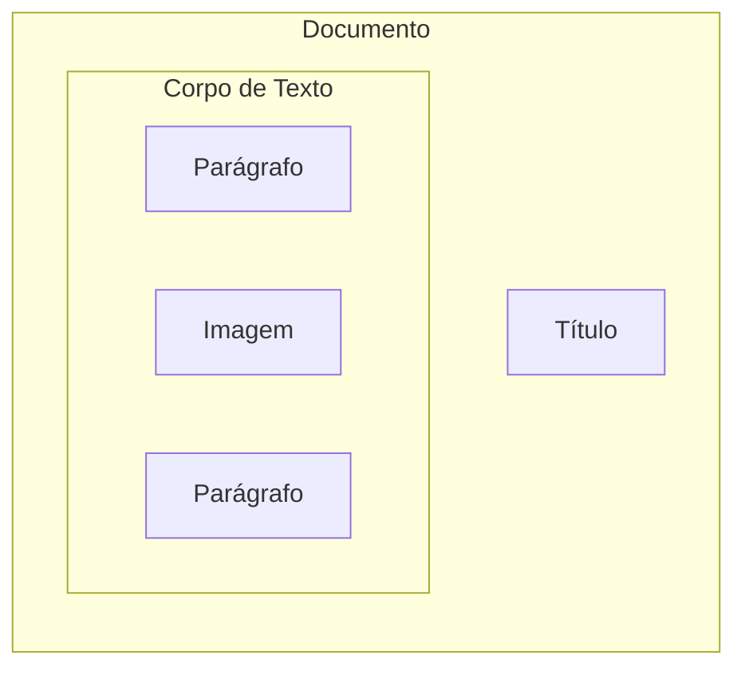

Documentos
---
**O que é um documento?** É qualquer registro de informações, independente do formato ou suporte utilizado para registrá-las.

Exemplo:


Representação dos elementos do documento acima:


DOM - Document Object Model
---
> Modelo de **Objeto de Documento**
>
É o padrão estabelecido para que os elementos de uma página html sejam dispostos pelo navegador. Ou seja, é através do HTML que elementos do DOM são criados e, assim, o navegador pode exibir o conteúdo de uma página.

Exemplo de um documento html:
```html
<article>
	<h1>Título do Documento</h1>
	<p>Lorem ipsum dolor sit amet, consectetur adipiscing elit.</p>
	<picture>
		  
	</picture>
	<p>Sed do eiusmod tempor incididunt ut labore et dolore magna aliqua.</p>
</article>
```
HTML - Hypertext Markup Language
----
> Linguagem de Marcação de Hypertexto

O HTML é uma linguagem de marcação. Linguagens de marcação são utilizadas para organizar informações de modo sintaticamente distinto. 

Para que tal organização aconteça, utilizam-se **tags** (etiquetas) que envolvem certo conteúdo e o separa dos demais. 

Ao abrir uma tag e fechá-la, você define um elemento.

Ao definir um **elemento**, você cria um **objeto de documento** no DOM que corresponde à este elemento.

Elementos e Atributos
---
Um elemento pode conter atributos, que são informações adicionais sobre aquele elemento.
```html
<h1 id="titulo-principal">Título do Documento</h1> 
<p id="primeiro-paragrafo">Um parágrafo...</p>
```
Entidades
---

&lt; &gt;


Classes e IDs
---
- Classes servem para agrupar elementos correlacionados. 
- IDs são **nomes únicos** atribuídos aos elementos.
```html
<h1 id="title">Notícia</h1> 
<p class="content">Lorem ipsum dolor sit amet, consectetur adipiscing elit.</p>
<p class="ad">Faça isso toda vez antes de ir dormir para emagrecer 10 kilos em 1 semana!</p>
<p class="content">Tempor incididunt ut labore et dolore magna aliqua. </p>
```
Elementos
---
**Links**:
```html
<a href="https://google.com.br">Ir ao Google</a>
```
**Imagens**:
```html

```
**Tabelas**:
```html
<table>
    <tr>
        <th>Aluno</th>
        <th>Nota</th>
    </tr>
    <tr>
        <td>Joao</td>
        <td>10</td>
    </tr>
    <tr>
        <td>Maria</td>
        <td>10</td>
    </tr>
</table>
```
**Blocos**:
```html
<div id="home">Página Inicial</div>
<div id="contact">Contato</div>
<div id="about">Sobre</div>
```
Problema: o HTML não foi projetado para dar estilo à um documento.

CSS - Cascading Stylesheets
---
> Folhas de Estilo em Cascata
>
O CSS possibilita a definição de propriedades que adicionam estilo para elementos HTML.

As propriedades são definidas dentro do escopo de um seletor. Este seletor, então, seleciona um elemento HTML e aplica tais propriedades.

 ```css
 seletor {
	 propriedade: valor;
	 propriedade-2: valor;
 }
 ```

Seletores 
---
 ```css
 seletor {
	 propriedade: valor;
	 propriedade-2: valor;
 }
 ```