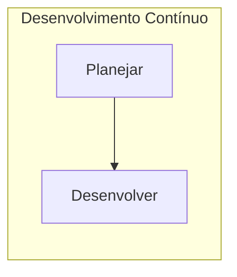
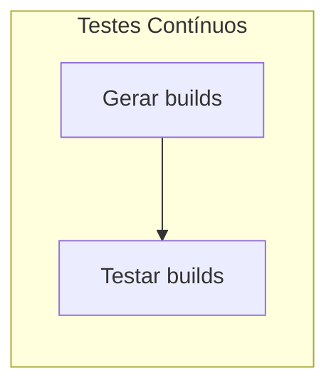
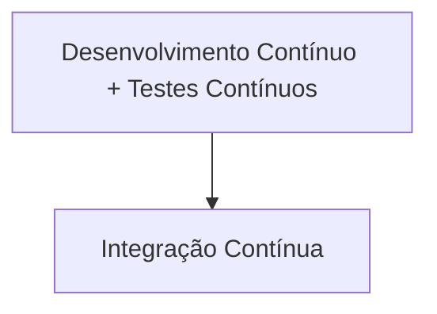

Categorias de Ferramentas DevOps
----
Algumas das ferramentas compõe o ciclo de vida de um projeto DevOps, enquanto que outras servem para a manutenção dos processos desenvolvidos entre as partes envolvidas.

**Ferramentas de Colaboração**: facilitam a comunicação entre os membros da equipe, contribui para a organização de tarefas. Recursos oferecidos: cards, edição de documentos simultânea, calendários. `Trello`, `MeisterTask`, `Gitlab`.

**Ferramentas para Revisão de Código**: Somente disponível na versão Starter do `Gitlab`. A maior parte das ferramentas disponíveis parecem ser pagas.

**Ferramentas de CI/CD**: aprimoramento contínuo através de entrega contínua, integração contínua. Algumas dessas ferramentas focam na automação de testes e lançamento de código. Outras focam em integração e entrega. Esse é o ponto do ciclo de vida onde o projeto cresce e se torna mais complexo. `Jenkins`, `Gitlab`.

**Ferramentas para Automação de Build**: para toda vez que um programador desenvolve código-fonte, é necessário que este código seja direcionado do repositório local para o repositório do projeto, onde este código será incorporado e irá interagir com a fonte principal. É importante que, durante esta etapa, seja averiguado que o novo código lançado não cause nenhum impacto negativo sobre a fonte principal. Por isso, existem ferramentas que desempenham testes para cada vez que o código é lançado. Essas ferramentas possibilitam também que módulos e processos possam ser mesclados, além da compressão e criação de pacotes. 

**Ferramentas para Automação de Testes**: estas ferramentas servem para que o desenvolvedor execute testes antes de que seu código seja lançado para uma ferramente de automação de build. 

**Ferramentas para Automação de Releases**: automatizam o processo de se lançar atualizações para uma aplicação.

**Ferramentas para Gerenciamento de Configurações**: estas servem para manter a consistência do projeto à nível da infraestrutura. Componentes desta infraestrutura são, por exemplo, servidores, armazenamento, redes ou sistemas operacionais. A consistência de um projeto possibilita a **escalabilidade** deste ao longo do tempo. Quando cada configuração é idêntica, seu gerenciamento se torna mais fácil. Ou seja, essas ferramentas possibilitam que alterações necessárias se tornem fáceis de serem implementadas.

**Ferramentas de Monitoramento para a Aplicação e a Infraestrutura**: não basta somente desenvolver e lançar software de forma ágil, é necessário aferir que nosso produto está funcionando com eficiência e consistência. Application Performance Monitoring/Management (APM). Essas ferramentas monitoram os recursos necessários para que a aplicação esteja operando do modo mais optimizado. 

**Ferramentas para Containerização**: servem o propósito de assegurar que o ambiente em que os desenvolvedores executam o código seja consistente. Um container serve como um pacote, um bundle, de todos os requisitos e dependências do projeto.

**Ferramentas para Serverless Computing**: um setor de operações comumente realiza manutenções nos servidores em que o projeto é compilado e executado. Mas, essa tarefa pode ser migrada para a nuvem, onde tempo é polpado com serviços como o AWS Lambda, que executa funções de acordo com requisições à uma API. 
> `Referência`: https://www.quora.com/What-are-some-good-uses-for-AWS-Lambda
>
Ferramentas e Etapas
---
**Versionamento de código**. `Git`.

____
**Automação de testes**. `TesteNG`, `Selenium`.

> O Selenium realiza a execução dos testes e o TesteNG gera os arquivos de log. Para que esse processo se dê de forma automática e se integre com as ferramentas de Entrega Contínua, entra um intermediário responsável pela **Integração Contínua**, que é responsável pela comunicação entre as duas primeiras etapas (Desenvolvimento Contínuo + Testes Contínuos) às etapas finais.
____
**Automação de tarefas**. `Jenkins`.


> Uma ferramente de integração contínua deve executar tarefas e automatizar processos dentro do ciclo de vida DevOps. Exemplos de caso de uso: 
> **Agendamento de Tarefas**: o Jenkins agenda tarefas para puxar (pull) o código-fonte do repositório principal e torná-lo pronto para gerar novas builds. Uma tarefa pode ser executada através de agendamento ou quando são detectadas alterações no código-fonte do repositório principal. Essas builds podem ser geradas por ferramentas especializadas, como o Gradle ou o Maven. Após então, com uma build gerada, o Jenkins pode direcionar o Selenium à realizar testes sobre esta build.
___
 **Gerenciamento de configurações**. `Puppet`.
 ```mermaid
graph LR;
subgraph Entrega Contínua
A[Deploy]-->B[Operações]
end
 ```

Após a build ter sido aprovada por todos os testes, a próxima etapa a ser encarada é a de deployment, ou, entrega. Aqui, o Jenkins conversa com as **ferramentas de containerização** e de **gerenciamento de configurações** para que o deploy da aplicação possa ser feito.

Gerenciar as configurações significa realizar a manutenção de servidores que contém o projeto após a liberação de uma nova versão e atualizações. O Puppet, por exemplo, utiliza a arquitetura master-slave, em que um deploy que o servidor master recebe são empurrados para servidores slaves. Em outras palavras, alterações no servidor master refletem diretamente sobre os servidores slave.

Enquanto isso, o Docker, uma ferramenta de containerização, cumpre o propósito de manter a consistência entre os ambientes de execução da aplicação. O que ele faz é executar o projeto e suas dependências dentro de um container que pode ser replicado entre inúmeros servidores.
___

 **Monitoramento**. `Splunk`, `ELK Stack`.
Finalmente, logo que a aplicação é finalmente entregue, se faz necessário monitorá-la a fim de detectar possíveis problemas que passaram despercebidos pelos testes automatizados.

Comparações Entre Ferramentas
---